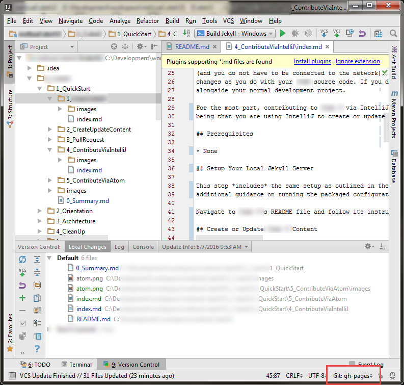
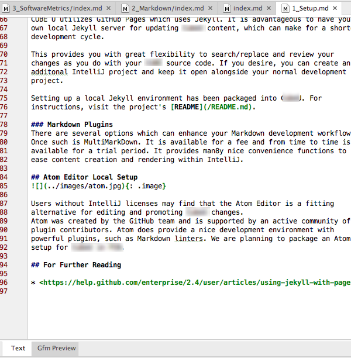
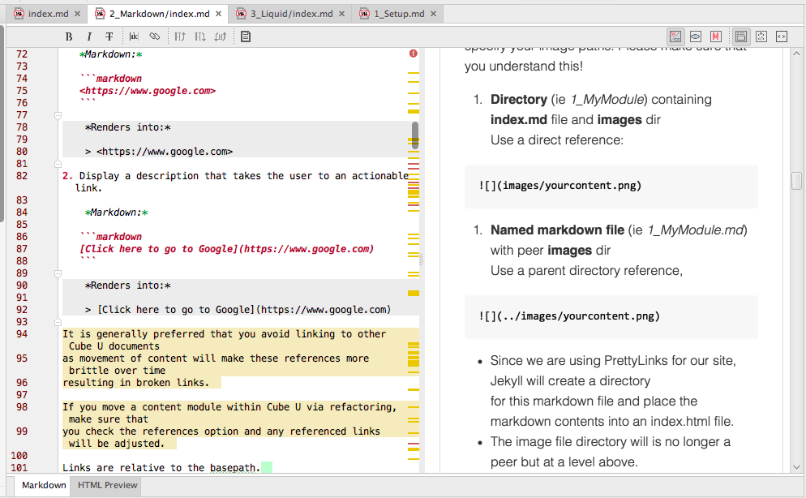



## Introduction

Squirrel U's Quick Start Guide outlines the easiest and quickest way to start contributing to Squirrel U for the most generic user. However,
if you are a developer with an IDE such as IntelliJ, you may prefer to work in that environment. The success of Squirrel U
relies on the active contributions of developers, so we've made it very easy for you to contribute this way. The Squirrel U project comes
with packaged configurations to get a local Jekyll environment up and running so that you can update and render the project locally (Squirrel
U utilizes GitHub Pages to render the Squirrel U site...and GitHub Pages uses Jekyll to do this).

It is advantageous to have your own local Jekyll server for updating Squirrel U content, which can make for a shorter development cycle
(and you do not have to be connected to the network). This provides you with great flexibility to search/replace and review your
changes as you do with your normal source code. If you desire, you can create an additional IntelliJ project and keep it open
alongside your normal development project.

For the most part, contributing to Squirrel U via IntelliJ has the same workflow as outlined in the Quick Start Guide, with the main difference
being that you are using IntelliJ to create or update content rather than doing so directly in the GitHub site.

## Prerequisites

* None

## Setup Your Local Jekyll Server

This step *includes* the same setup as outlined in the Quick Start Guide (**Create (Fork) Your Copy of Squirrel U**), with
additional guidance on running the packaged configurations to get your local server up and running.

Navigate to Squirrel U's README file and follow its instructions: <https://github.com/zippyzsquirrel/squirrel-u/blob/gh-pages/README.md>

## Create or Update Squirrel U Content

Before making updates, make sure that your branch is set to gh-pages in IntelliJ.  If it isn't, update accordingly.

{: .image}

**NOTE:** If your team is in the habit of using named branches for joint development, you
won't want to do that for Squirrel U, you'll always want to use gh-pages. If you need
to compartmentalize work on various features, use stash/unstash.  We are not currently committing to master so you will notice that master is
way behind. We may push all changes there at some point, but it really serves no purpose.

At this point, you can update or create content within the project structure in the same way you are familiar with any other github projects.

Remember that all Squirrel U content uses the Markdown syntax with a standard Content Template, which can be
found on the **Content Template** page.  Simply copy the template and paste it into your new file when creating new content pages.

**Not familiar with Markdown?** Markdown is a very simple markup language that provides the ability to write plain text content
for web pages. Visit the **Markdown Overview** page for more information.

### Test on Your Local Server

Before you submit a Pull Request on your changes, you'll want to see how they will look in Squirrel U. *Always* test your changes
before submitting your content for approval.

If you have set up your local server as outlined above and your server is running, you should usually be able to see your changes right
away by navigating to <http://127.0.0.1:4000>. Your local server for the most part will render like content will on your Fork
and on the main repository. However, always remember that the local Jekyll server may contain features not yet available in the 
packaged Enterprise GitHub.

Initial startup involves building the content hierarchy, which requires two passes
of Jekyll running.  Once started, however, updates are incremental.

**When do I need to restart my local Jekyll server?**

* If you add new page directories or files, you *will* need to restart your server as
that will rebuild the directory hierarchy.

* If you changed the status of a page (such as removing ""), you
*will* need to restart the server to be able to view see the icon disappear.

* If you change page content or any styles (css or sass) you will *not* need to
restart your server. Jekyll performs an incremental build, which is quick.

Continue making updates until the content is rendered correctly and your changes meet all Squirrel U standards.

### Commit and/or Push

Commit and/or Push your changes to your Squirrel U personal fork using the same IntelliJ mechanics as you would any other source code. If
you need help with this, you can take a look at the **Code, Commit and Push** page. **Make sure that you are pushing to *origin: gh-pages* **
(*not* "upstream" or "master"!).

**Avoid committing these files:**

There are certain infrastructure files which you should avoid committing.

  * /hierarchy-template.html - this file
  * _includes/* - and specifically hierarchy.html - will appear modified
  * _layouts/*
  * _sass/*
  * _site/
  * fonts
  * scripts
  * setup
  * stylesheets
  * css
  * Gemfile
  * Gemfile.lock - will appear modified
  * .idea

The files which appear modified are due to your runtime configuration and the
fact that they are tracked in GitHub.  Once tracked, these files cannot be
ignored.

## Create a Pull Request

Creating a Pull Request is outlined in the Quick Start Guide (**Submit Cube U Content for Approval**). After you have pushed
all of the changes you would like included in your Pull Request, you can complete these steps to request that your changes be
merged.

**You can also create a Pull Request directly in IntelliJ.**  See the sub-section "In IntelliJ" under "Create a Pull Request" in
the **Pull Request and Review** page.  The **Base fork** will be where you want to merge and the **Base branch** will be "gh-pages" (*not* master!).

## Optional Plug-ins

**Standard Markdown**  
This option gives you a simple Markdown editing editor with an HTML preview pane. Download these free plugins for basic editing and rendering:

 * Markdown   
 * Markdown Support 
 * Gfm (GitHub Flavored Markdown) 

The Gfm plugin isn't mandatory but will enforce a GitHub Flavor when rendering:  
{: .image}

Enable these plugins:  
{: .image}

Viewing Markdown provides a rendered tab view next to your source code tab:  
{: .image}

**MultiMarkdown**  
The second option is to download a more advanced, fee based plugin called 
[MultiMarkdown](https://github.com/vsch/idea-multimarkdown/wiki/Enhanced-Features). 

The plugin is available with full functionality for a trial period and then 
reduces to a more limited set of features after the trial. Functionality 
provides a side-by-side rendering of Markdown and rendered content and many nice
convenience functions to ease content creation and rendering within IntelliJ. It
is also actively maintained and the developer is extremely responsive to 
suggestions and bug reports. 

Download Plugin:
{: .image}

Enable plugin, but make sure to disable the Markdown, Markdown Support and Gfm 
plugins:  
{: .image}

Here's how the viewer looks:  
{: .image}

## For Further Reading

* <https://help.github.com/enterprise/2.4/user/articles/using-jekyll-with-pages/>

