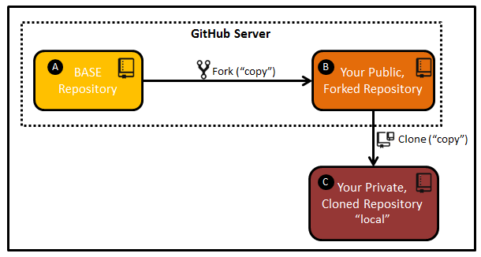
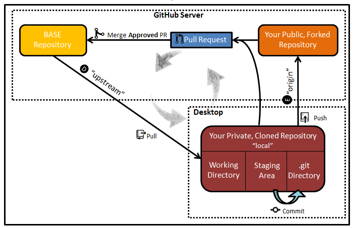



## Introduction

This section provides a summary of the workflows chosen for GAIG by  Developer, Tech Lead and Release Manager roles.

## Prerequisites

* None

## GAIG GitHub Repository Model

{: .right}

By now, you've viewed the Organizations and Repositories that comprise Squirrel.  See [GitHub Repository Overview]({{ site.github.url }}/3_Development/1_Setup/3_projectSetup/2_gitHubRepositoryOverview/).

Although GitHub can support direct commit of master branches in primary Repositories,
GAIG is not using such a direct commit model for developers.

The following access roles are used across GAIG Repositories:

 * Developer - READ only (clone) privilege
 * Approver - READ and APPROVE privilege

Squirrel is using an approval-based commit model rather than direct commits.
Direct merging to master branches may only be done by an Approver (typically a Tech Lead).

However if you have an Approval role and have to merge your own code,
request another Approver to do the "approval" merges on your behalf.

## Basic Workflow

### Setup Workflow

{: .image}

**A - BASE Repository:** This is the “gold” standard of the code repository, where the aggregate of everyone’s accepted changes live on
the GitHub server.  For example, releases are taken from this repository.
**B - Your Public, Forked Repository:** This is a “copy” of the BASE repository (A) that lives under your username on the GitHub server.  This repository
is created by "forking" the BASE repository.
**C - Your Private, Cloned Repository "local":** This is a “copy”  of your GitHub repository that lives on your local machine. This repository is created by "cloning"
your public, forked repository.

**Fork**

Create a copy (B) of the BASE repository (A) by using a command called “Fork”.  In general, you will only do this the
first time you are setting up your personal GitHub repository (B). A Fork is your PUBLIC copy of any Repository, which
is stored directly on the GitHub server.  Any needed Repositories must be forked by each user.  The primary repositories
will reflect how many users have forked their own public copies.  For example, you can see that the Squirrel-ws-clients
repository has been forked 48 times.

{: .image}

**Clone**

Create a copy (C) of your personal GitHub repository (B) on your machine using a command called “Clone”.  In general,
you will only do this the first time you are bringing the project down to your machine.  A Clone is a copy of your
PUBLIC repository on your local machine. Although you can directly modify files on public Forks, it is typical to
Clone so that you can work in your own private environment.

### Development Workflow

{: .image}

**D and E - "upstream" and "origin":** In relation to your “local” repository, there are two “remote”
repositories.

The connection from your local repository to the BASE repository is called “upstream” (D), which is how
updates from the BASE repository are retrieved to your Cloned repository.  After Cloning, you will need to manually
set up this connection.

The connection from your local repository to your public GitHub repository is called “origin” (E). During the process of
Cloning, a pointer back to your public, forked repository is set up automatically. After making the desired changes in
your local environment, you push your changes to "origin".

**Commit**

As you make changes to the code on your local machine, use the 
“Commit” command to move them from the Staging Area to the .git Directory.  “Commit” 
does NOT have any affect on the repositories living in GitHub.

**Push**

When you have changes that you would like to send to your personal 
repository on GitHub, you will do so with a command called “Push”.  In this step, you 
are “Pushing to ‘origin’”. 

**Pull**

In order to stay up-to-date with the BASE repository, you will use 
a command called “Pull”.  This command will update your private, local repository with 
the most recent “gold” code.  This command includes merging BASE repository code with 
your “local” changes.  In this step, you are “Pulling from ‘upstream’”.  You should be 
doing Pulls on a very regular basis (multiple times per day).

**Pull Request**

In order to make changes to the BASE repository (A), you will generate a “Pull Request”.  A
Pull Request is a request for an Approver/Tech Lead to review your code and determine if it
is fit to move into the BASE repository.

**Merge**

If a Pull Request is approved, the changes associated with the Request are Merged into the
BASE repository.  If it is rejected, the Approver will comment on the issue and reject the
Pull Request; the BASE repository remains unchanged.

## Tech Lead Workflow

 * Monitor for Pull Requests  
     * Periodically check PR Viewer for PRs from team members  
     * Open PRs received via email or message (@mentions)  
     
 * Review pending PR  
     * Various review approaches:
        * review file differences by the whole PR. 
        * Review file differences by each commit.  
     * If the PR can be cleanly merged, the green Merge button will be displayed  
     * If Approving, merge (and proceed through the screens)
     * If it cannot be cleanly merged, then you'll need to use manual file changing and possibly reset / rebase / cherry picking 
       to isolate the changes and bring things together cleanly.  
     * Tech Lead could also reject and ask team member to resolve on their private branch.  
 
  * Pruning PRs  
     * Probably a good idea to have a goal of exiting a sprint with no open PRs
     * This will require some diligence on the part of tech leads to review/commit/reject  

  * Tech Lead should not approve their own PR (?)
  
## Release Lead Workflow
  
  * There no longer needs to be a long code freeze, aside of a momentary pause to allow for a base head version 
    to be tagged.  
  * Tagging is done via Git tags, which can be applied via IntelliJ 
  * Tagging scheme is a three part scheme:  [see Isaac for detail]
    NOTE: we've discussed going to four part scheme ... when?
  * This tagging has to be applied to the 5 supported Squirrel-* repositories.  
  * Maven snapshots need to be created / managed.  TODO: detail from Isaac
  * How to build a release to send to Jenkins and up the stack
    something like: https://help.github.com/articles/creating-releases
  * Distribute the release to the appropriate system (Jenkins) ...
    TODO what else needs to happen?

## For Further Reading
  
* Links