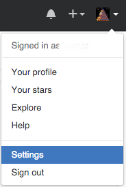
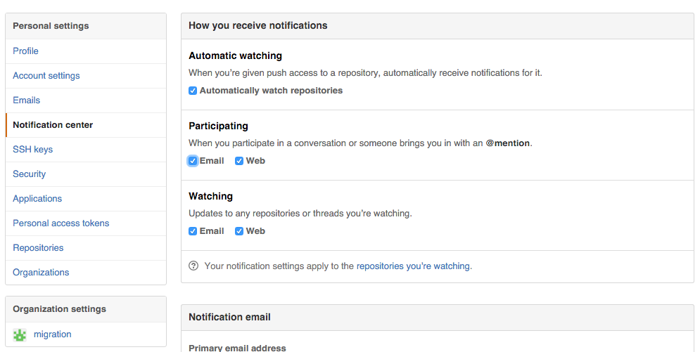
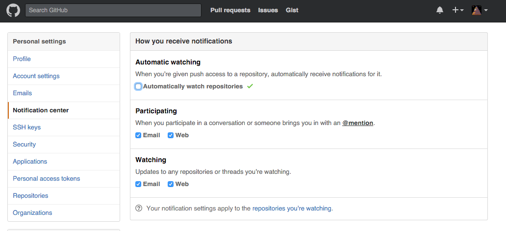
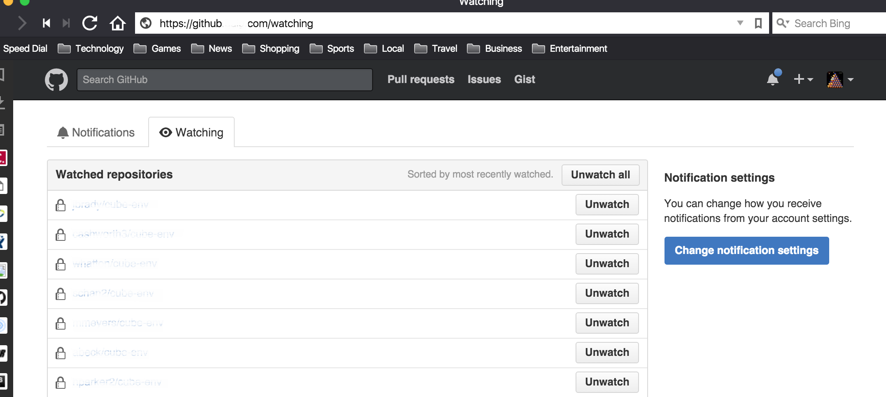
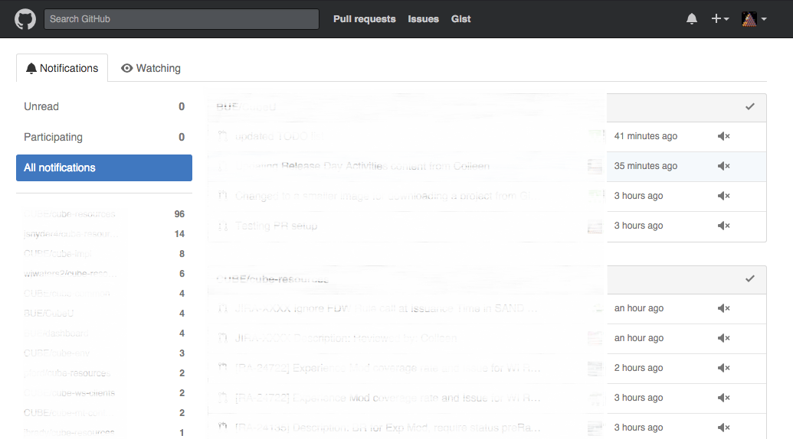



## Introduction

GitHub provides notifications for changes to repositories which you are interested in.  
These notifications are displayed on your GitHub page and may also be sent via email.  

This section is intended to help you manage the volume of this information.  

## Prerequisites

* GAIG GitHub account  

## A strategy for cutting down the noise  
By default the option to be notified for changes to any repository that you have access to is selected by default.  
Unfortunately this results in a lot of notification traffic, including notifications from every single developer's forks.  

Here's a strategy to narrow down the notification traffic that might work for you:  

### Specify how you want to be notified about GitHub activity   
 1. Login to github.gaig.com  
 
 2. Click on your user Icon and select Settings  
   {: .image}  
  
 3. Go to Notification Center  
     {: .image}  
 
 4. In "How you receive notifications", toggle off "Automatically watch repositories"  
         {: .image}  
 
 5. Toggle email and web notifications to your preferences:  
     a. **Participating** - for notifying when you are/have been mentioned (ie @jkohl2)  
     b. **Watching** - for when any repositories of interest change   
 
### Narrow down the Repositories
 1. From the same Notification Center, Click on the "repositories you're watching" link:  
    {: .image}  
    
 2. Select the Watching tab  
    {: .image}  
    
 3. Click "Unwatch all"  
     {: .image}  
     
 4. Now select the Repositories tab, and click on a link to a repository that you are interested in:    
    {: .image}  
   
 5. Click on the "Watch" button and select "Watching". 
    {: .image}  

 6. Repeat this for any other base repositories of interest:  
   a. BUE/CubeU  
   b. active sub-projects for n-cube or CUBE
   c. Team mate's forked repositories if you are directly collaborating with them  

## Reduced Repository list
An additional benefit of reducing the list of repositories that you are watching includes  
only getting those repositories that you are watching when you are creating a new project from version control,  
rather than a list of every single person's forked repositories.  

## Viewing Notifications  
All the web notifications are easily found by clicking on the bell icon:  
 {: .image}
 
From there you can view unread notifications as well as view all notifications grouped by repository.  
 {: .image}

## Clearing Notifications
Generally a good thing to clear out the day's notifications once you've taken a quick look by marking all messages as read.   
  {: .image} 

## For Further Reading

* Links