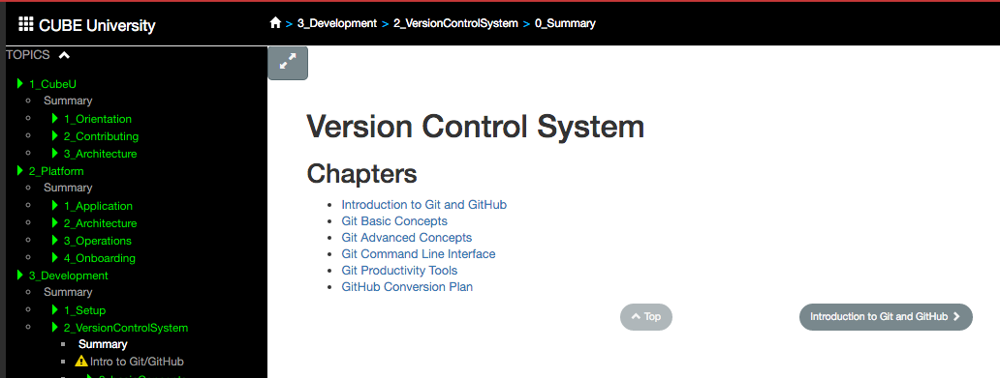
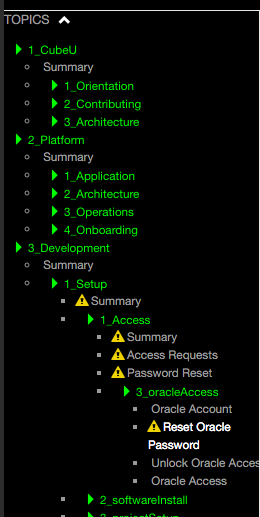



## Introduction  

CubeU was designed to help you explore new topics and quickly find the answers 
you need to get problems resolved quickly. This section walks you through the 
various areas of the site. 

The primary ways of getting to content are Featured Courses, Course Summary 
Pages, Content Pages, Hierarchy and Search. 

## Prerequisites

* Access to GAIG Enterprise GitHub and BUE/CubeU Repository. 

## Featured Courses

On the front page of CubeU, you will find a set of the more popular course 
sections links. This collection of sections will change as new sections are 
offered. 
  
You can always return to this page by clicking on the house in the breadcrumb 
trail.  

{: .image} 

## Course Summary Page

After selecting a course, you will be taken to a summary page containing 
sub-section and page links for that section. 

{: .image} 

Anytime you navigate to a new section or page, the content will be highlighted in 
the hierarchy to the left.

## Content Page 
Each content page follows a similar structure providing a brief introduction, any 
prerequisites, content and a list of "Further Reading" links at the bottom of the 
page. 

{: .image} 

Lets take a closer look at some of the navigational and convenience features on each page.  

### Breadcrumb Trail

In some websites, breadcrumb trails are used to provide a set of previously 
visited links. Since a web browser provides adequate capability for doing this 
already, CubeU is using breadcrumb trails for a different purpose. 
    
At the top of the page, a breadcrumb trail provides a quick navigation up and 
down the hierarchy. Clicking on any section to the left of the selected topic 
allows you to quickly return to an upper hierarchy level. The text displayed is 
based on the directory or file name to provide a consistent naming with the item 
in the GitHub file hierarchy.  

### Distraction Free Mode
 This icon toggles display of hierarchy 
and search sections. 

{: .image} 

### Reading Time
 Estimated reading time is displayed for each 
non-summary page.  
An average non-technical reading rate is an average of 275 wpm. 
CubeU calculates a rough reading time using a technical rate of 100 wpm. This 
time may be adjusted based on actual usage over time. 

### Page Status
 "Under Construction" pages are marked with a 
cautionary symbol.  
This symbol is also displayed in the content hierarchy. This 
symbol indicates that pages are not fully curated or some aspect of the page is 
under development. Once fully curated, this status should be changed in the 
page's FrontMatter section to remove this icon. 

### Edit Mode 
 An edit button is displayed on non-Summary pages.  
The Edit button takes you directly into GitHub to edit a content page. Such an 
edit button is only displayed when editing on your fork. 

**Always make sure that you are editing on the gh-pages branch. GitHub pages does 
not use the master branch.**

_Edit will not appear while running Jekyll from localhost as you are 
already editing within your IDE._ 

_Edit will not appear on the main BUE/CubeU pages because you should not directly 
be making commits to the BASE repository and instead be using Pull Requests. If 
you want to correct a page from BUE, simply change the BUE in the URL to your 
fork's username and you will be taken to the equivalent page for editing._ 

### TOC
For each page, a Table of Contents is generated from all the headings specified 
in a page's Markdown. The TOC provides context as to whether the page contains 
relevant material per your search and serving as a quick navigation option for 
larger pages. As a guideline, please attempt to keep the nesting level of headers 
to three levels so as to provide a compact TOC.   

### Page Sequence Navigation 
{: .image} 

When you scroll downwards a number of lines 
in a page, a set of buttons will appear near the bottom of the page. 

If there is prior content in a sequence of content, a "previous" nav button 
containing the content title will appear on the left side of the page. 

The center button will take you back to the top of the page. 

If there is future content in a sequence of content, a "next" nav button 
containing the content title will appear on the right side of the page. 

## Hierarchy
At the heart of CubeU is the content hierarchy, where all content has been 
arranged in a (hopefully) logical taxonomy of material. This hierarchy reflects 
the structure of directories in the CubeU repository directories. Hierarchy is 
built from main topics, to summary sections, which contain individual content 
pages.  

The values used in the Summary sections are based on each Page's "breadcrumb" 
FrontMatter text. The section headings are derived from the directory paths used 
in the GitHub directory path.  

This hierarchy appears on the left hand side of your browser.  
{: .image}  

You can expand and collapse the whole hierarchy by clicking on the caret button 
at the top of the hierarchy. Individual subsections can be toggled opened and 
closed. Currently the site is set expand only the section that you have selected 
and close all other sections which you are not viewing.  

When you select a topic from the breadcrumb trail, search or an internal link, 
the topics's section will be opened and the topics will be highlighted.  

{: .image}  

Any pages still "Under Construction" are displayed with cautionary symbol in the 
content hierarchy. This symbol is also displayed on the page itself. 

## Search
{: .image}  
Search provides a very fast keyword based search capability based on Page Title, 
Author, Tags (keywords) and a 20 word excerpt of the page. Therefore it is 
critical to pay close attention to the values placed into these fields. Too many 
general tags will result in too many results for a given search. Too little will 
leave the content unfound.  
 
Specify additional keywords in search to further refine the results.

Once you've found various results, you can quickly inspect the content by by 
navigating to the links in the search results. If not the desired result, the search 
results are maintained even when you switch pages in the hierarchy, breadcrumb 
trail or link from a given page. 

## For Further Reading

* None