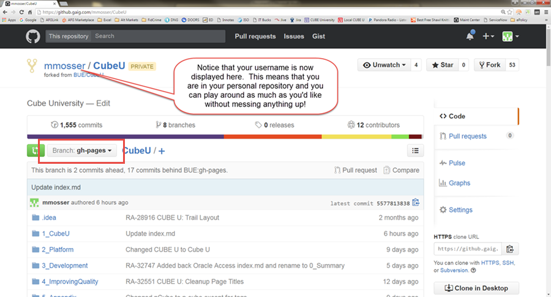
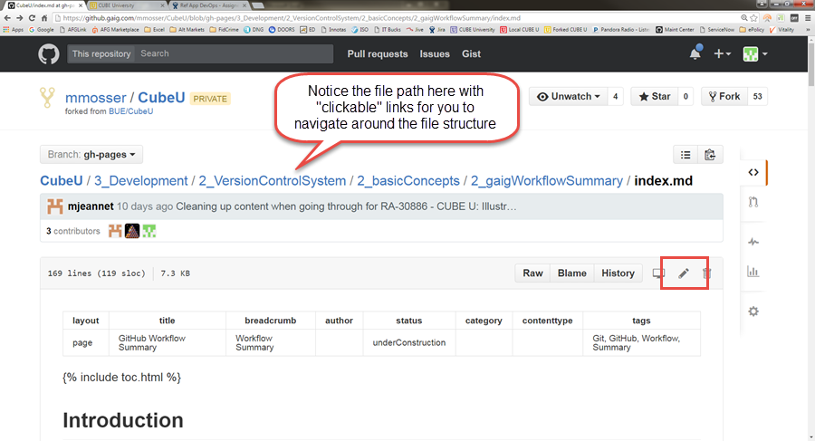
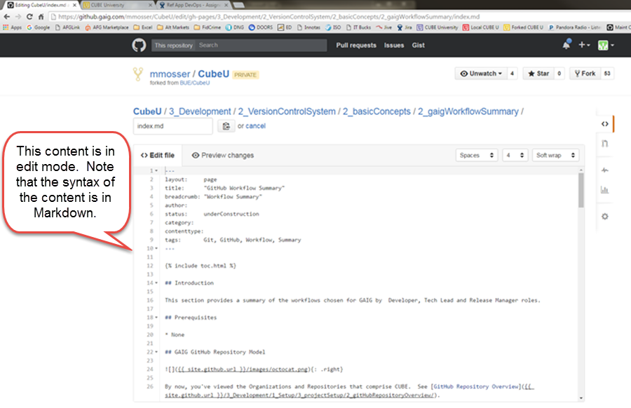
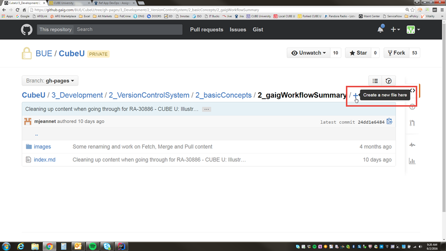
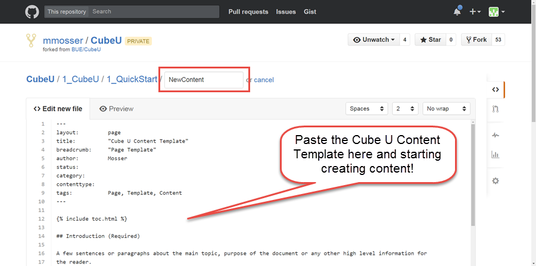
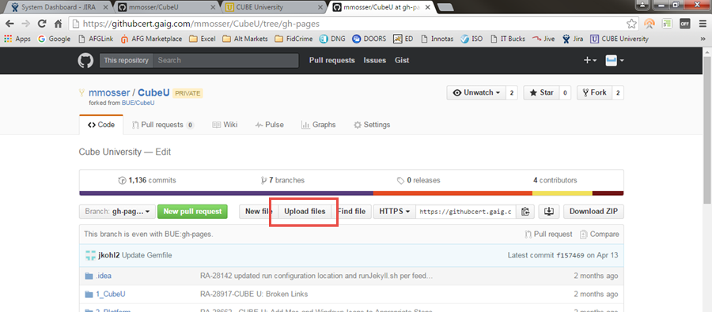
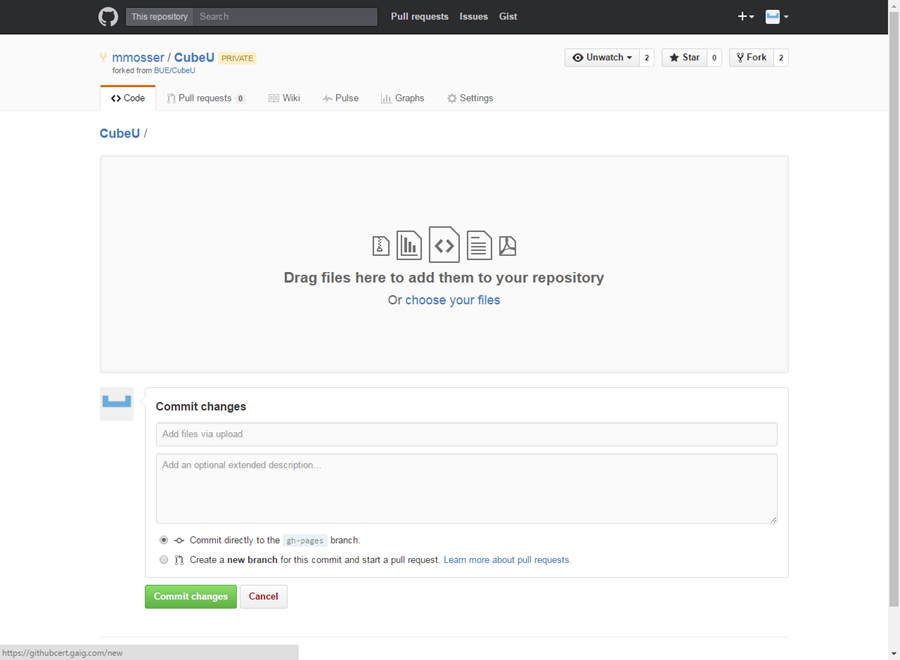
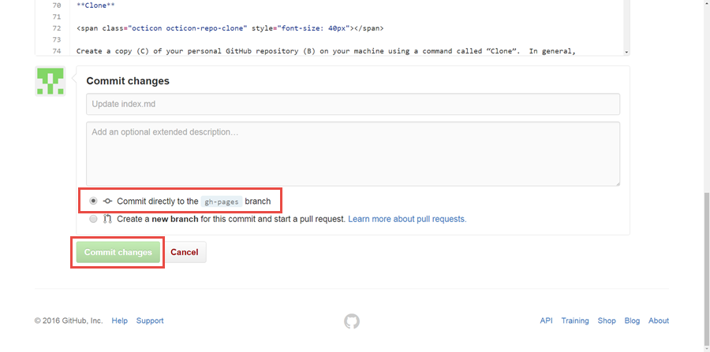
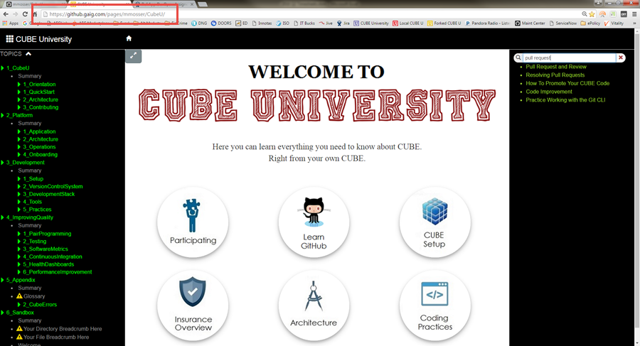
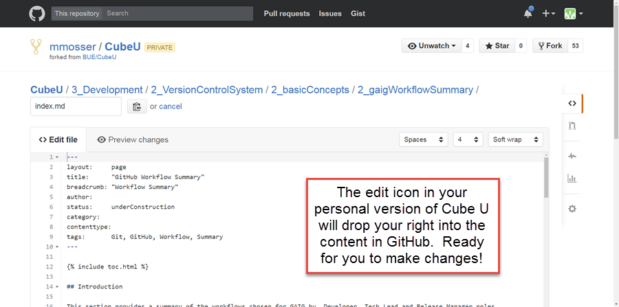



## Introduction

This section will give you a quick overview of how to create or update content directly in GitHub.

## Prerequisites

* You'll need access to the "BUE" organization in GitHub.  Take a look at the Prerequisites on the **Get Started Contributing to Cube U**
page for assistance with this.
* **If you're creating *new* content**, you'll want to copy the content on the **Cube U Content Template** page to your clipboard.
* Before making updates, just make sure that you are within your personal repository (not the "BUE" repo) and that your branch is
**gh-pages**.  After you have logged into GitHub, this is as simple as adding "/yourUsername/CubeU" to your URL (i.e. https://github.gaig.com/mmosser/CubeU).

{: .image}

## Update Existing Content

1. Remember that the Cube U repository is just a file system like any other. To update existing content, simply navigate to
the file containing the content that you would like to update.

    In the example below, we've navigated to the "GitHub Workflow Summary" page of Cube U.

    Click the **Edit** icon (looks like a pencil) to change your view to edit mode.

    {: .image}

2. Once you're in edit mode, you can update the content as needed using Markdown (and *only* Markdown to maintain site consistency).

    **Not familiar with Markdown?**  Markdown is a very simple markup language that provides the ability to write plain text
    content for web pages. Visit the **Markdown Overview** page for more information.

    {: .image}

## Create New Content

**STOP!** Before you create new content, ask yourself, "Does this content already exist?" One of the main objectives of Cube U
is to create a single source of truth for the knowledge contained within.  Make sure you have done your research in determining
if there is already content in Cube U related to the material you would like to add. It may be possible that all you need to do is
edit or enhance a document that is already out there. Ask your team mates, subject matter experts and/or the DevOps team if you think
that your content may already exist somewhere in Cube U.

1. Remember that the Cube U repository is just a file system like any other. To create new content, simply navigate to
the location where you would like to create or upload a file or create a directory.

    **To create a new file**

    Click the **+** (plus) icon at the end of your current file path to add a new file in that directory.

    {: .image}

    {: .image}

    **To create a new directory**

    Follow the instructions to create a file, but add a forward slash (/) after the title.

    **To upload a new file** (Not available at this time. We are waiting for an update to GitHub Enterprise version 2.6)

    Use the **Upload** button to locate the file on your machine and commit to your fork

    {: .image}

    {: .image}

2. You're ready to create your content! Just give your file a name and paste the content template you copied in the prerequesites.
Use the template as a guide to complete your content with Markdown (and *only* Markdown to maintain site consistency).

    **Not familiar with Markdown?**  Markdown is a very simple markup language that provides the ability to write plain text
    content for web pages. Visit the **Markdown Overview** page for more information.

## Save ("Commit") Content

All done? You're ready to save ("commit" in Git terms) your changes to your personal repository.

Scroll down to the **Commit changes** section and add a title (something simple to say what your changes are about) and any comments
you want to make about the your commit.

Make sure the **Commit directly to the gh-pages branch** radio button is selected and click **Commit changes** when you're ready. You
can also trash your changes by clicking **Cancel** if you'd like.

{: .image}

## Test Your Rendered Content

Before you're ready to request approval on your changes, you'll want to see how they will look in Cube U. *Always* test your changes
before submitting your content for approval.

It's very easy to see this!  Just add "/pages" between ".com" and your username in the URL (i.e. https://github.gaig.com/pages/mmosser/CubeU/).

Viola! Your personal repository is displayed as the Cube U website! Check out your content and see what it looks like!

{: .image}

**Something not right? Do you need to make another update to your content before requesting approval?**

No problem! While you're within your personal repository's rendered content, just click the **Edit** icon (looks like a pencil)
in the upper, right corner of the content page.  You'll be redirected right into the edit mode of your content in GitHub.

{: .image}

From there, you can make your changes and commit as needed and repeat this process until you're happy with everything.

{: .image}

**Test Your Tagging**

You might also want to do some searches for your content with some keywords you think people might use to look for your material.
Update your tags in the Front Matter to enhance the "searchability" of your document.  Make it as easy as possible for people to find your
valuable knowledge!

See the "Tags" section of **Front Matter Overview** for more information on the tagging feature.

**Everything look good? Now you're ready to submit your changes for approval!**

## How to Keep Your Fork Up to Date

Throughout the entire content contribution process, it is absolutely critical that you keep your
fork up to date with the BUE/CubeU repository. This will help to avoid merge conflicts and ensure that you are always
working with the most recent changes to Cube U.

1. Make sure you are on your personal fork and in the gh-pages branch. Next to the branch drop-down, click the green button
to "compare branches".

    

2. Click the "compare across forks" link

    {: .image}

3. You will see the **base fork** and **head fork** default to the BUE/CubeU repository

    {: .image}

    Change the left repository **base fork** to *your* CubeU repository fork.  The right repository **head fork** should remain
    set to BUE/CubeU (*both* branches should be set to "gh-pages)"

    {: .image}

4. If you see "There isn't anything to compare" displayed and you're sure that the base and head forks are set correctly, this
means that your fork is already up-to-date with BUE and there are no changes for you to pull.

    Otherwise, click on the **Create pull request** button.

## FAQ

**I need to start all over, but I've committed changes.  What do I do?**

As long as you don't want to keep any of the changes (commits) you've made, you can just delete your fork and create a new one
from BUE: gh-pages.  This will give you a fresh, current copy of the "official" Cube U content. Follow the instructions in the
"How to Delete a Fork" section of the **Create (Fork) Your Copy of Cube U** page.

**What if my work is in progress? Should I still put it in Cube U or wait until it's finalized?**

Cube U is still the best place for content that is a work in progress. The great thing about working in GitHub is that others can
view the content on your personal fork and give feedback on your draft before it ever goes to the "official" Cube U site. The
easiest way to share your content is to just send your team mates the URL to the page in question on your personal fork
(i.e. https://github.gaig.com/pages/mmosser/CubeU/1_CubeU/1_QuickStart/2_CreateUpdateContent/). When they click the link, they'll go straight to that page
in *your* fork of Cube U.

You may also want to consider using the "underConstruction" status in the Front Matter of your content until the content is finalized.
**Need help understanding Front Matter?** Take a look at the **Front Matter Overview** page for assistance.

**What if I have no idea where I should put my content?**

If you aren't sure where to put your content, start by asking a team mate or another subject matter expert on the topic. They
may have valuable input on where your content should go. If your team still is not sure where the best fit is for your content,
we have created a "Ground" directory in which you can place your content in the meantime. Best placement can be determined
when you submit your content for approval, based on collaboration with the reviewer.

## For Further Reading

* You can expedite the approval process by reviewing the **Cube U Guidelines Checklist** page and making sure that your content
adheres to these guidelines before moving forward. This checklist summarizes items that the reviewer will be looking at with respect
to Cube U's standard formatting and content standards.

