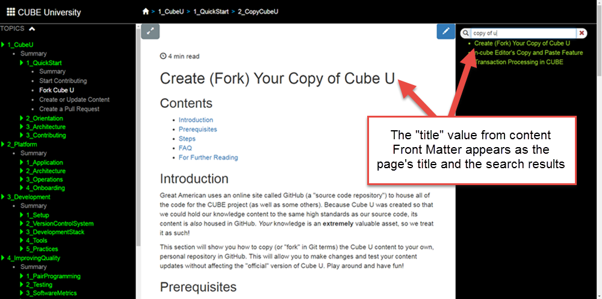
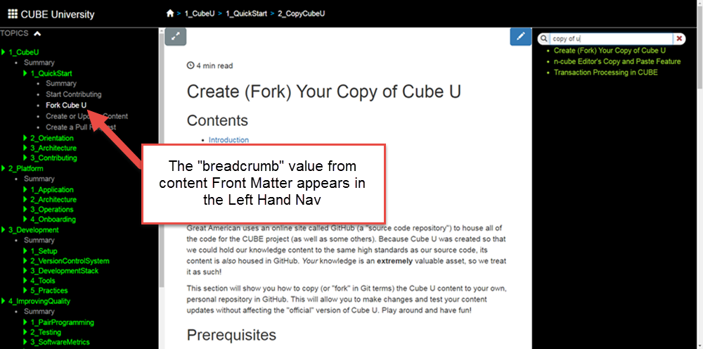
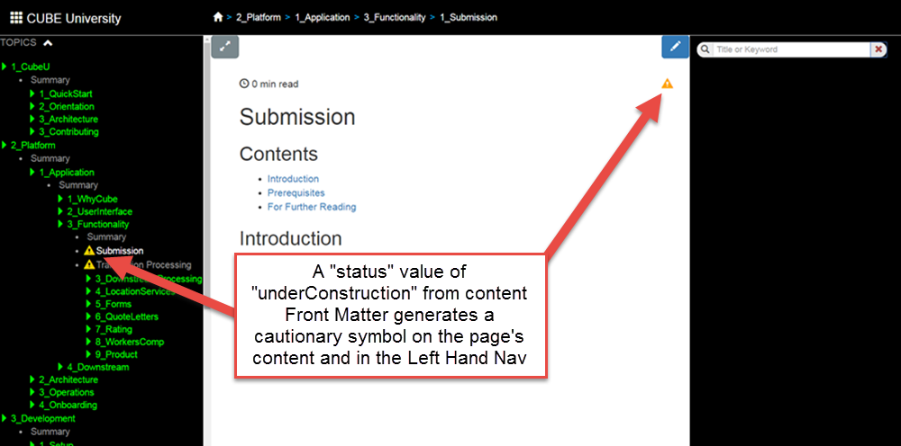



## Introduction

Jekyll breaks a page up into a few sections, including Front Matter and Content.

At the beginning of each Markdown (md) file, Jekyll looks for the presence of 
Front Matter. The term "Front Matter" comes from the idea of all the material 
that comes at the "front" of a publication. For any md file to be processed, 
it must have Front Matter.  Think of Front Matter as metadata describing the 
page and contents.

This section will go through each data element that Front Matter should contain 
for every page in the Cube U site.  Front Matter can be different for every
project/site, but we are focusing on what has been chosen for Cube U content.

## Prerequisites

* None

## Example

Here is an example of Front Matter for Cube U content.  This "block" should be
included at the top of *every* index.md file in the Cube U directory structure.

```markdown
---
layout:         page
title:
breadcrumb:
author:
status:
category:
contenttype:
tags:
---
``` 

## Elements Explained

### Layout (Required)

The value of "layout" should always be either "page" or "summary". We are using Jekyll's
"pages" concept, which is utilized for storing our hierarchy of folders and
pages. In short, the pages concept allows for a large hierarchy of content
where temporal information is not a priority (as opposed to the "posts"
concept, which is utilized for storing and retrieving time-based content). Use "page" in all cases except where you
are creating a "0_Summary" page for a section of content.

### Title (Required)

Include a proper case title within quotation marks that succinctly
describes the page's content (i.e. "Front Matter Overview"). The page title
indicated here will display at the top of the content page and in the search feature results. If a title
contains a term that is also commonly referred to as an acronym, make sure
you spell out the full name.  You can include the acronym in parenthesis
after the full name (i.e. "Runtime Product Model (RPM)")

{: .image}

### Breadcrumb (Required)

Include an abbreviated version of the page title in quotation
marks.  If abbreviating the page title is not practical, simply include the
page title again.  The breadcrumb title included here will be used in the Left Hand Nav.
The object for the breadcrumb is to be as short as possible while still being meaningful.

{: .image}

### Author (Required)

This should be the proper case last name of the author and/or
contributors of a page of content.  If more than one, a comma separated list
must be used (i.e. Kohl, Mosser)

### Status (Optional)

The only valid value for this element at this time is
"underConstruction" (or leave it blank).  Adding "underConstruction" denotes that the page is still a work in progress and lets
users know that there may be incomplete or unverified information.  Pages should not remain "under construction" for very
long. Content with an "underConstruction" status
will display an under construction symbol in the top, right corner of the
page and in the Left Hand Nav to indicate to readers that the content has not been finalized.

{: .image}

### Category (Not Used)

Not used at this time, leave this blank.

### ContentType (Not Used)

Not used at this time, leave this blank.

### Tags (Required)

Tags are used in the search indexing process.  Create multiple tags for your contribution in Front Matter by using a comma
separated list in the Tags section of Front Matter. Results in a search activity will include content that contains a Front
Matter tag.  Tags are an *extremely* important element that contribute directly to the success of the Cube U site.

Pay careful attention to what text you use for tags. Common English words are automatically stripped / ignored. Pick keywords that sum
up the article. Include any keywords that are particularly unique or may prove beneficial to the reader during search. Words
such as "CUBE" are too general. Acronyms, words or phrases such as RPM are perfect.

If you are specifying an acronym, please also provide the expanded phrase represented by the acronym. Following these guidelines
will help establish a high quality search index.

## For Further Reading

* None