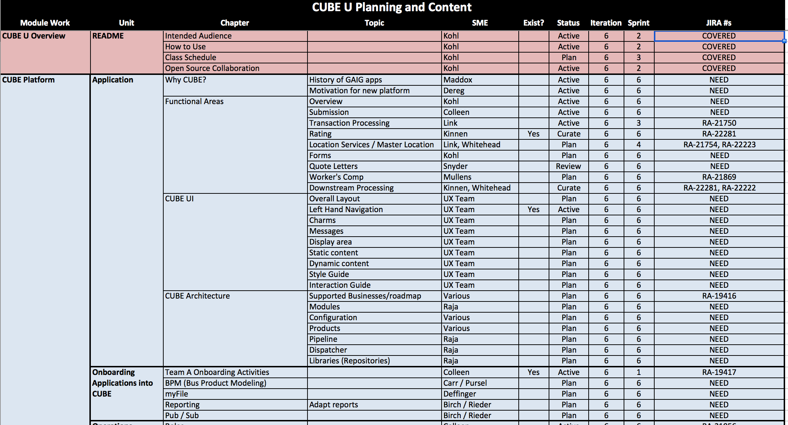
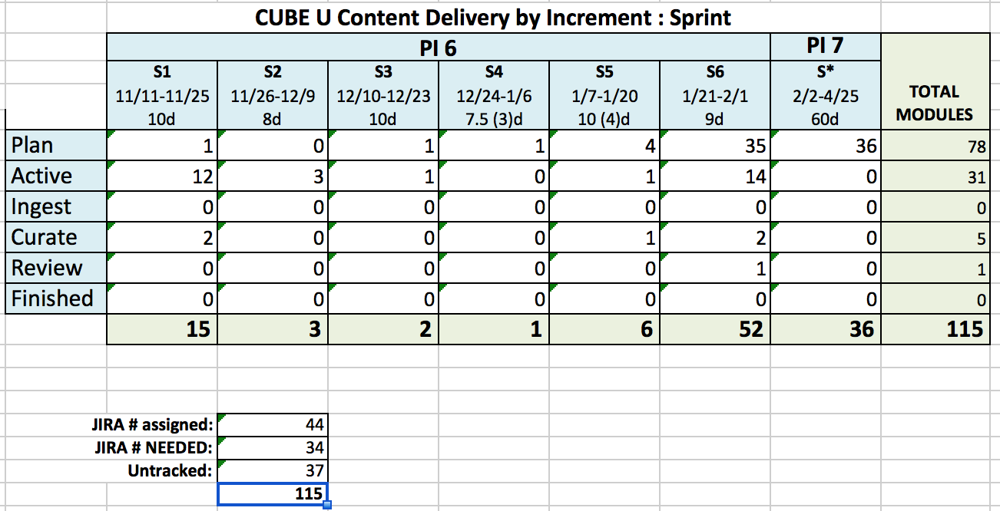



## Introduction
This section lays out the plan for populating CubeU content.  
 
## Prerequisites
* None

## Cube U Content Strategy

### Phases
There is so much to do in capturing content, so we've planned our work around 
specific phases.

**Proprietary Content**
For PI 6, we focused on capturing the more proprietary content of CUBE. This 
ensured we got the things that may be less familiar to newcomers and also to get 
these critical pieces documented in the event that team members depart GAIG. 

**Non-proprietary Content**
For PI 7 and 8, we are are focusing on the remaining content which is more about 
all the other more open source technologies *as applied* at Great American. 

### Evolution of Content
We believe that learning best occurs by direct application with plenty of good 
examples through repetition. Initially though we need to get the base 
information rounded up in a simpler text format with text and graphics.

Later we plan on adding short videos and actual code examples. One of the great 
benefits of using GitHub is the ability to include actual source code in the 
style of plunkrs. We will also explore the incorporation of Kata based learning 
into CubeU. 

### Evolution of Platform
We have focused more on function and less on form at this juncture.

We plan on:

 * improving the layout and style of the site. 
 * resolving a few known issues which we will resolve after the content work is 
   completed.

We also want to add a mechanism that can review the existing content tree and 
flag deficiencies or recommend better placement. We've been calling this system 
"Squirrel" in the manner of creatures scavenging, gathering and storing 
knowledge acorns. This is a future yet vital project that has not yet commenced.

## Workflow Process for Initial Content

As CubeU works to become a reality, we are depending on the efforts of many 
teams to submit their expertise. We are also pulling in existing content from 
Jive, Sharepoint and other sources.

So we've defined these workflow steps to get your content into CubeU:

  * **Plan** - specify a delivery Sprint; mark in Planning Worksheet
  * **Active** - you've actually begun the work in the planned sprint
  * **Ingest** - we've received your content and converting to Markdown format
  * **Curate** - we are adapting the content to be consistent with Cube U style
  * **Review** - we've sent a link back to you for your blessing
  * **Finished** - content is ready for consumption

## Tracking Spreadsheet

We are using a [Content Tracking Spreadsheet](https://gaig.jiveon.com/docs/DOC-27534) 
for our planning purposes. We've asked Tech Leads and/or Scrummasters to update 
the progress on the individual content pieces.

The spreadsheet contains a detailed list with status of all planned content 
modules. If you think of any items that are missing, please add them (and let us 
know). {: .image} 

There is also a summary worksheet which details the status of these items 
throughout Program Increment 6, 7 and 8. {: 
.image} 

## For Further Reading

* Links